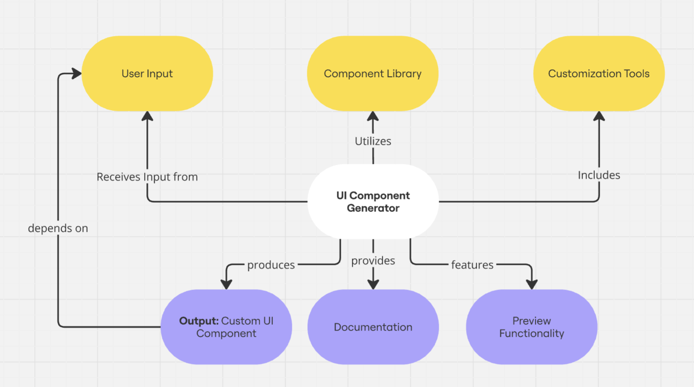

# Introduction

- PublishUI is a UI component library that provides a set of reusable and customizable components for web applications.
- Styled as a magazine, this project is a way to showcase the components in a visually appealing and interactive manner.
- **Tech Stack**: Vanilla JavaScript, HTML, CSS
- **Components**: Button, (more to come...)

## Installation & Setup

1. Clone the repository:

   ```bash
   git clone https://github.com/cristian-castro-oliva/publishUI.git
   ```

2. Cd into the project:

   ```bash
   cd CustomComponentBuilder
   ```

3. Install the dependencies:

   ```bash
   npm install
   ```

4. Start the development server:

   ```bash
   npm -w proto start
   ```

5. Open your browser and navigate to `http://127.0.0.1:8080/` to see the project.

## Concept Diagram



- **Link:** https://miro.com/app/board/uXjVLaY6bpY=/?share_link_id=719833017301
